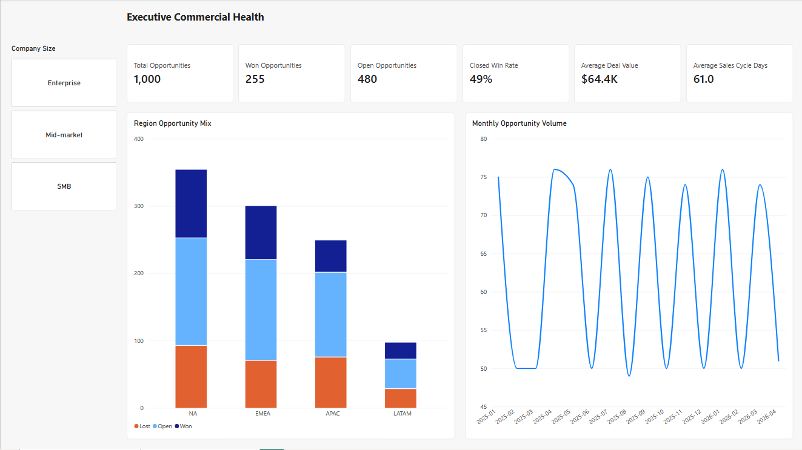
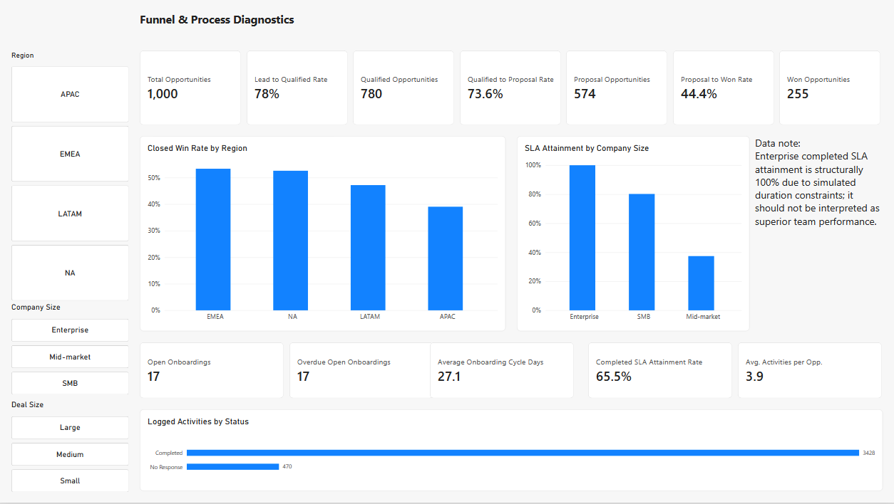

# Business Operations Analytics — Sales Funnel and Customer Onboarding

An end-to-end portfolio project using SQL and Power BI to analyse a simulated B2B sales and onboarding process. The project demonstrates KPI design, denominator control, data-model validation, segment analysis, and evidence-bounded operational recommendations.

> All data is synthetic. Results demonstrate an analytical workflow and do not represent a real company, customer, employee, or achieved business outcome.

## Dashboard

### Executive Commercial Health

### Funnel & Process Diagnostics

The current Power BI file is [`powerbi/Project-B-Business-Operations-Analytics-v2.pbix`](powerbi/Project-B-Business-Operations-Analytics-v2.pbix). It contains two interactive pages with Region, Company Size, and Deal Size filtering where relevant.

## Business problem

The simulated company needs a reliable view of commercial funnel health and onboarding execution. The analysis addresses four management questions:

1. Where does the sales funnel lose momentum?
2. Which customer segments require operational attention?
3. Does logged sales activity show a consistent relationship with closed win rate?
4. Do completed-case SLA metrics conceal unresolved backlog risk?

## What I built

- A four-table analytical dataset covering 240 accounts and 1,000 opportunities from 2025-01-01 to the 2026-08-31 snapshot.
- SQL views and checks for opportunity-grain joins, funnel KPIs, onboarding SLA logic, segment comparisons, and reconciliation outputs.
- A Power BI model with a Calendar table, explicit measures, two report pages, interactive slicers, and controls against opportunity double counting.
- Three findings and three quantified management recommendations, with stated owners, targets, tracking metrics, and limitations.

## My contribution and AI assistance

**Andy personally:** completed the Phase 1 basic SQL and JOIN acceptance exercises; explained KPI denominators and why activities must be aggregated before joining to outcomes; imported the CSVs into Power BI; set data types; created the Calendar table and relationship; entered and explained every DAX measure; completed the final Page 2 slicer layout; and saved the current v2 PBIX.

**AI-assisted:** synthetic-data and SQL scaffolding, validation-query drafts, guided explanations, presentation-layer support, documentation drafts, and portfolio packaging. AI-authored scripts are included as reproducible project assets, but are not presented as proof of independent advanced-SQL mastery. Numeric claims were checked against SQL outputs and the dashboard baselines.

## Core KPI baseline

| KPI | Result |
|---|---:|
| Total opportunities | 1,000 |
| Lead-to-Qualified conversion | 78.0% |
| Qualified-to-Proposal conversion | 73.6% |
| Proposal-to-Won snapshot conversion | 44.4% |
| Closed-opportunity win rate | 49.0% |
| Average deal value | $64.4K |
| Average closed sales cycle | 61.0 days |
| Average completed onboarding cycle | 27.1 days |
| Completed SLA attainment | 65.5% |
| Overdue open onboardings | 17 |

Definitions and denominator rules are fixed in the [KPI contract](docs/kpi_contract.md). Dashboard results were reconciled against the SQL baselines.

## Key findings

The three findings below confirm mechanisms intentionally embedded in the simulated data. They demonstrate analysis and interpretation; they are not presented as independent discoveries about a real business.

### 1. Completed-case SLA reporting conceals overdue backlog

Completed SLA attainment is 65.5%, but its denominator excludes unfinished cases. All 17 open onboardings were already overdue at the snapshot. Mid-market performance is the main completed-case concern: 37.4% SLA attainment across 99 activated cases and a 33.0-day average cycle.

**Recommendation:** manage completed performance and open risk separately. Within 10 business days, triage all 17 overdue cases and assign an owner, next action, and recovery date. For the next comparable Mid-market cohort, use a maximum 30-day average cycle because 30 days is the simulated Mid-market SLA. At the same 99-case volume, moving from 33 to 30 average days would equal about 297 fewer case-days as a scenario calculation, not realised savings.

### 2. Logged activity does not have a consistent relationship with win rate

Large deals with three or fewer logged activities show a 30.4% closed win rate, versus 43.5% for four activities and 38.9% for five or more. Small deals move in the opposite direction. The data does not support the claim that simply increasing activity volume will improve win rate.

**Recommendation:** do not impose an activity-count target. The current data cannot measure follow-up quality because it lacks next-step owner, due-date, and blocker fields. Define those fields within 30 days and require 100% completeness in the next Large-deal pilot cohort. This enables a later cohort test; no win-rate or revenue impact is claimed.

### 3. APAC Enterprise is the weakest Proposal-to-Won segment

APAC Enterprise records 9 wins from 37 proposals, a 24.3% snapshot conversion rate. Other region × company-size segments combine to 246 wins from 537 proposals, or approximately 45.8%. The result contains 3 open proposals, is a snapshot rather than a mature cohort, and reflects an embedded simulation mechanism. It identifies a review priority rather than a causal explanation.

**Recommendation:** review all 3 open proposals within 10 business days and complete a 30-day retrospective review of the 25 losses (19 Budget, 6 Competitor). A 35% sensitivity scenario is retained only to size an improvement roughly halfway toward the 45.8% comparison rate: it would equal about 13 wins from 37 proposals, four more than the baseline, but is not a target or prediction.

The detailed evidence, owners, targets, and tracking metrics are documented in [Phase 3 findings and recommendations](docs/phase_3_findings_recommendations.md).

### How the targets were set

The 30-day Mid-market cycle threshold comes from the simulated SLA. The 10-business-day and 30-day review windows are proposed operating cadences, not statistically derived optima. A 100% completeness target applies only to newly required data fields. The 35% APAC Enterprise figure is a midpoint sensitivity scenario, not a KPI commitment.

## Validation and analytical controls

- Opportunities remain at one row per `opportunity_id`; activities are aggregated before joining to outcomes.
- Dashboard totals and one company-size onboarding segmentation were reconciled with SQL outputs.
- Completed onboarding metrics exclude unfinished cases, while overdue open backlog is reported separately.
- Proposal conversion is labelled as a snapshot metric because open proposals remain in its denominator.
- Lead source was tested as a non-embedded exploratory comparison and retained as inconclusive rather than promoted to a fourth finding.
- The PBIX was saved, closed, and reopened successfully during Phase 2 validation.
- Phase 4 verified the screenshots and saved filename; it did not repeat the earlier interaction test. A screenshot alone is not evidence that filters work.

## Limitations

- The dataset is deterministic and simulated; several mechanisms were intentionally embedded and must not be presented as independent discovery.
- Earlier v1 results influenced the frozen v2 generation rules.
- Segment differences are descriptive and do not establish causation.
- Enterprise completed SLA attainment is structurally 100% because generated durations cannot exceed its 45-day SLA; it is not evidence of superior execution.
- The model does not include staffing, finance, renewals, product telemetry, or marketing-attribution data.
- Industry remains available in the data and SQL outputs but is not exposed as a visible dashboard slicer in the final two-page report.
- Estimated impacts are transparent management scenarios, not realised savings, revenue, or forecasts.

## Repository guide

| Location | Contents |
|---|---|
| [`portfolio/PROJECT_SUMMARY.md`](portfolio/PROJECT_SUMMARY.md) | One-page hiring-manager summary |
| [`RUNBOOK.md`](RUNBOOK.md) | SQL execution order and Power BI refresh instructions |
| [`portfolio/screenshots/`](portfolio/screenshots/) | Two Power BI dashboard screenshots |
| [`powerbi/`](powerbi/) | Current editable PBIX |
| [`sql/02_end_to_end_analysis.sql`](sql/02_end_to_end_analysis.sql) | End-to-end KPI analysis |
| [`sql/04_phase3_comparisons.sql`](sql/04_phase3_comparisons.sql) | Final finding comparisons |
| [`data/sample/`](data/sample/) | Small reviewable samples of the four source tables |
| [`data/processed/`](data/processed/) | Processed simulated CSVs, SQLite database, and SQL baselines |
| [`docs/kpi_contract.md`](docs/kpi_contract.md) | KPI definitions and denominator rules |
| [`docs/data_dictionary.md`](docs/data_dictionary.md) | Table and field definitions |
| [`docs/data_generation_assumptions.md`](docs/data_generation_assumptions.md) | Simulation design and disclosure |
| [`docs/phase_0_validation_results.md`](docs/phase_0_validation_results.md) | Data and environment validation |
| [`docs/phase_1_validation_results.md`](docs/phase_1_validation_results.md) | SQL acceptance record |
| [`docs/phase_2_validation_results.md`](docs/phase_2_validation_results.md) | Power BI acceptance record |
| [`docs/phase_3_findings_recommendations.md`](docs/phase_3_findings_recommendations.md) | Findings and recommendations |
| [`docs/phase_4_validation_results.md`](docs/phase_4_validation_results.md) | Portfolio-package acceptance record |
| [`docs/pre_phase_5_review.md`](docs/pre_phase_5_review.md) | Publication review and corrections |

## Tools and demonstrated skills

- **SQL:** joins, conditional aggregation, CTEs, date logic, denominator control, validation queries, and opportunity-grain safeguards.
- **Power BI:** Power Query typing, relationships, Calendar table, DAX measures, interactive filtering, report design, and SQL reconciliation.
- **Business Operations:** KPI definition, backlog visibility, segment prioritisation, target setting, responsible-role assignment, and cautious interpretation.

## Project status

Phases 0–4 are complete. Phase 5 interview materials are prepared, but personal speaking and live-filter acceptance are not yet passed. The full execution scope and stop lines are documented in the [revised implementation plan](docs/implementation_plan_revised.md).
